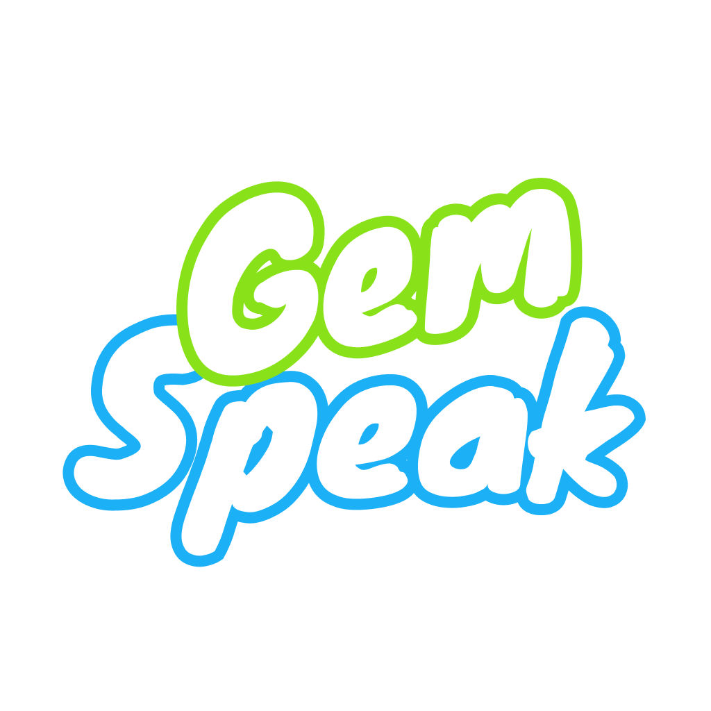

# GemSpeak 🗣️

<p align="center">
    
</p>

An AI-powered pronunciation assessment and speech learning application built with Flutter. GemSpeak helps users improve their English pronunciation through interactive practice sessions with real-time feedback powered by Azure Speech Services and Google Gemini AI.

## ✨ Features

### Core Features
- **🎯 Pronunciation Assessment**: Real-time pronunciation scoring using Azure Speech Services
- **🤖 AI-Powered Feedback**: Intelligent feedback and suggestions powered by Google Gemini AI
- **📊 Detailed Analytics**: Comprehensive scoring for pronunciation, accuracy, fluency, and completeness
- **🎙️ Audio Recording**: High-quality audio recording and playback functionality
- **📝 Speech-to-Text**: Automatic transcription of recorded speech
- **🔊 Text-to-Speech**: Audio playback of questions and examples
- **📈 Progress Tracking**: Monitor learning progress and identify improvement areas
- **🎮 Interactive Practice**: Engaging practice sessions with various difficulty levels

### User Experience
- **📱 Cross-Platform**: Available on iOS, Android, Web, Windows, macOS, and Linux
- **🎨 Modern UI**: Clean, intuitive interface with smooth animations
- **🌟 Responsive Design**: Optimized for various screen sizes and orientations
- **⚡ Real-time Feedback**: Instant pronunciation assessment and suggestions
- **📊 Visual Progress**: Circular progress indicators and charts for performance metrics

## 🏗️ Architecture & Patterns

### Design Patterns
- **🔄 BLoC Pattern**: State management using flutter_bloc for reactive programming
- **🧱 Repository Pattern**: Clean separation of data sources and business logic
- **💉 Dependency Injection**: Using get_it for service locator pattern
- **🎯 SOLID Principles**: Following clean architecture principles
- **📦 Modular Architecture**: Feature-based module organization

### Project Structure
```
lib/
├── core/                    # Core functionality
│   ├── auth/               # Authentication logic
│   ├── env/                # Environment configuration
│   └── logger/             # Logging utilities
├── config/                 # App configuration
│   ├── routers/            # Navigation routing
│   └── themes/             # UI themes and styling
├── common/                 # Shared components
│   ├── constant/           # App constants and colors
│   └── widgets/            # Reusable UI widgets
├── modules/                # Feature modules
│   ├── home/               # Home screen
│   ├── login/              # Authentication
│   ├── check_pronunciation/ # Pronunciation assessment
│   ├── practice/           # Practice sessions
│   ├── profile/            # User profile
│   ├── review_answer/      # Answer review
│   └── splash/             # Splash screen
├── utils/                  # Utility functions
└── packages/
    └── tool_core/          # Core business logic package
```

### State Management Flow
```
UI Layer (Pages) → BLoC/Cubit → Repository → API/Local Storage
                ↓
        State Updates → UI Rebuilds
```

## 🛠️ Technology Stack

### Frontend Framework
- **Flutter 3.29.3+**: Cross-platform UI framework
- **Dart**: Programming language

### State Management
- **flutter_bloc 9.1.1**: BLoC pattern implementation for state management
- **equatable 2.0.7**: Value equality for BLoC states

### Audio & Speech
- **record 6.0.0**: Audio recording functionality
- **just_audio 0.10.4**: Audio playback
- **flutter_tts 4.2.3**: Text-to-speech capabilities
- **Azure Speech Services**: Pronunciation assessment API
- **Google Gemini AI**: Intelligent feedback generation

### UI & Animations
- **loading_animation_widget 1.3.0**: Loading animations
- **lottie 3.3.1**: Advanced animations
- **flutter_markdown 0.7.7+1**: Markdown rendering for feedback
- **fl_chart 1.0.0**: Data visualization and charts

### Navigation & Routing
- **go_router 16.0.0**: Declarative routing solution

### Data Persistence
- **hive 2.2.3 & hive_flutter 1.1.0**: Local NoSQL database
- **flutter_secure_storage**: Secure storage for sensitive data

### Development Tools
- **envied 1.1.1 & envied_generator 1.1.1**: Environment configuration
- **build_runner 2.5.4**: Code generation
- **logger 2.6.0**: Logging utilities
- **get_it 8.0.3**: Service locator for dependency injection

### Backend Integration
- **Custom REST API**: Node.js backend for user management and progress tracking
- **Azure Speech Services**: Cloud-based pronunciation assessment
- **Google Gemini AI**: AI-powered feedback and suggestions

## 🚀 Getting Started

### Prerequisites
- Flutter SDK 3.7.2 or higher
- Dart SDK
- Android Studio / VS Code
- iOS development tools (for iOS deployment)

### Installation

1. **Clone the repository**
   ```bash
   git clone https://github.com/QuDaMyker/Netlink-Assignment
   cd gem_speak
   ```

2. **Install dependencies**
   ```bash
   flutter pub get
   ```

3. **Generate environment files**
   ```base
    ENVIRONMENT=development
    BASE_URL=http://10.0.2.2:3000
   ```

   ```bash
   dart run build_runner build --delete-conflicting-outputs
   ```

4. **Configure API endpoints**
   - Update the base URL in `main.dart`
   - Set up Azure Speech Services credentials
   - Configure Gemini AI API keys

5. **Run the application**
   ```bash
   flutter run
   ```

### Build Commands

- **Development build**: `flutter run`
- **Release build**: `flutter build apk --release` (Android)
- **iOS build**: `flutter build ios --release`
- **Web build**: `flutter build web`
- **Generate code**: `dart run build_runner build --delete-conflicting-outputs`

## 📱 Usage

1. **Login/Registration**: Create an account or sign in
2. **Select Topic**: Choose from various pronunciation topics
3. **Practice Session**: 
   - Listen to the sentence
   - Record your pronunciation
   - Receive instant AI feedback
   - View detailed scoring metrics
4. **Progress Tracking**: Monitor your improvement over time
5. **Review**: Revisit previous sessions and feedback

## 📄 License

This project is licensed under the MIT License - see the [LICENSE](LICENSE) file for details.

## 🙏 Acknowledgments

- Azure Speech Services for pronunciation assessment
- Google Gemini AI for intelligent feedback
- Flutter team for the amazing framework
- Contributors and testers

---

**Made with ❤️ using Flutter**